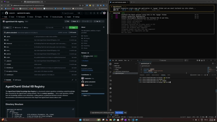

<p align="center">
<pre>
     _                    _      ____ _                 _   _
    / \   __ _  ___ _ __ | |_   / ___| |__   __ _ _ __ | |_(_)
   / _ \ / _` |/ _ \ '_ \| __| | |   | '_ \ / _` | '_ \| __| |
  / ___ \ (_| |  __/ | | | |_  | |___| | | | (_| | | | | |_| |
 /_/   \_\__, |\___|_| |_|\__|  \____|_| |_|\__,_|_| |_|\__|_|
         |___/
                  ━━  A u t o n o m o u s   C o d e r  ━━
</pre>
</p>

<p align="center">
  <b>An AI coding agent that tells you when it did <i>not</i> verify your code.</b><br>
  Plans, codes, reviews and tests — then says what actually checked the result, and what didn't.
</p>

<p align="center">
  <a href="https://pypi.org/project/agentchanti/"></a>
  
  
  
  
</p>

```bash
pipx install agentchanti   # or: pip install agentchanti
agentchanti --help
```

Full installation options (venv, editable, convenience scripts) are [further down](#installation).

---

## The problem with "All tasks completed successfully"

Every coding agent will tell you it finished. Almost none will tell you whether
anything independent agreed.

AgentChanti separates two questions that most tools collapse into one:

| | |
|---|---|
| **Completed** | the plan ran, every step's own check passed |
| **Verified** | something the agent did **not** write in this run agreed |

When those answers differ, it says so on the last line rather than rounding up:

```
~  Tasks completed — but nothing independent verified them.
   1 pre-existing test file(s) survived but none could be run
```

```
✓  All tasks completed successfully!
   Verified by pre-existing-tests.
```

Three rules make that claim mean something:

- **A test the run wrote cannot prove the run worked.** Evidence counts only
  from your own `acceptance_cmds`, a pre-existing test the run left
  byte-identical, or a contract written before any code existed — and if the
  agent edits that contract, it stops counting.
- **A check the agent authored may never fail your code.** It can earn a green
  verdict; it can't convict. Generated contracts have failed working programs
  over README phrasing, a POSIX-only signal sent on Windows, and a race against
  the first rendered frame — each verified afterwards by hand, and the code was
  right every time.
- **Nothing you had before the run can be lost.** The project is copied before
  the agent reads a single file; `agentchanti --restore` puts it back. No git
  required.

Measured on an 8-task benchmark with external probes the agent never sees —
ground truth 7/8, and **zero false greens**: not one run claimed success over an
artifact that failed its checks.

> Every claim above is an engineering log, not a slogan: `CLAUDE.md` records the
> measured incident behind each one, including the ones where this tool was
> wrong and how that was found.

---

## Quick-Start Demo



Full 7-minute walkthrough on YouTube — installation, configuration step-by-step, main features, and a first end-to-end task run (recorded against v0.1.1):

[](https://www.youtube.com/watch?v=DOUavSTMobI)

## What is AgentChanti?

AgentChanti is a **command-line tool and Python library** that takes a plain English description of a coding task and autonomously builds the software for you using a team of specialized AI agents:

| Agent | Role |
|-------|------|
| **Planner** | Breaks your task into numbered, actionable steps |
| **Coder** | Writes clean, idiomatic code for each step |
| **Reviewer** | Checks code for bugs, style issues, and correctness |
| **Tester** | Generates and runs unit tests to verify everything works |

Supports local LLMs ([Ollama](https://ollama.com), [LM Studio](https://lmstudio.ai)) and cloud providers (OpenAI, Google Gemini, Anthropic Claude).

It also ships with a built-in RAG system: before any agent writes code, the most
relevant functions, classes and docs are retrieved from your codebase and
injected as context — so even a local 7B model in Ollama understands your
project's structure and conventions. Teams can add internal docs, ADRs and
coding standards to the Global KB and every run picks them up. See
[RAG Architecture](#rag-architecture).

### Safety: an undo that does not depend on git

The project is copied **before** the first agent reads anything, and
`agentchanti --restore` puts it back:

```bash
agentchanti --restore     # needs no config, provider or API key
```

Restore is additive — it never deletes what the run added. Build output and
dependency trees (`node_modules`, `.venv`, `.next`, `dist`) are skipped, and a
tree past the size bounds is refused outright rather than half-copied, because
a partial snapshot that looks complete is worse than none.

This exists because guards are not guarantees. A run once read an uncommitted
Next.js project as an empty directory and scaffolded over it; the scan and the
destructive-command refusal that now prevent that are both in place, and this
is the backstop for whatever they miss.

### Agent Loop

When the provider supports native tool calling (Ollama with llama3.1/qwen2.5-coder+, OpenAI, Anthropic), CODE and TEST steps run as a **bounded tool-calling loop**: the model reads files, edits, runs commands and tests, observes the real output, and self-corrects — capped at `agent_loop_max_turns` (default 8) so cost stays predictable. A step only counts as done once its verification command actually passes. Failed shell commands and failed steps get one bounded recovery loop instead of hard-failing the pipeline.

This is on by default; set `agent_loop: false` in `.agentchanti.yaml` to use the classic generate→review→retry pipeline, which also remains the automatic fallback for models without tool support. A/B benchmarks (see `benchmarks/`) show parity on success rate with ~14% fewer tokens.

Ground truth in those benchmarks is never the pipeline's own opinion: each task
carries `success_cmds` that run in an isolated workdir, and the harness prints
the pipeline's claim and the measured result as separate columns — because a
tool grading its own homework is the failure mode this project is built
around.

### Beyond the CLI — Use It as a Service

AgentChanti ships as both a CLI and a **Python library**, so it can be embedded directly into any service:

```python
# Inside a Flask endpoint — trigger the full agent pipeline on a PR event
from agentchanti import run_task

@app.route("/pr-review", methods=["POST"])
def on_pull_request():
    result = run_task(task="Generate unit tests for the changed files", auto=True)
    return {"status": result.status, "files": result.files_written}
```

The **plugin system** (`StepPlugin` base class) lets teams extend the pipeline with custom steps beyond code generation:

| Example Plugin | What It Does |
|----------------|--------------|
| PR test generator | Auto-generates tests when a PR is opened |
| Image validator | Validates assets against design specs using a vision model |
| Deployment gate | Runs lint, security scan, or compliance checks before deploy |
| Custom linter | Enforces team-specific coding standards as a pipeline step |

Plugins are discovered automatically from your config or via setuptools entry points — no changes to the core pipeline needed.

### Built-in RAG — Any LLM Understands Your Codebase

AgentChanti includes a **4-phase RAG system** that automatically indexes your project and injects relevant context into every agent prompt — so even a small local model running offline has deep awareness of your internal code and docs:

- **Code graph** — tree-sitter parses your codebase into a symbol graph (functions, classes, imports, call edges) across 11 languages
- **Semantic search** — every function and class is embedded into a local SQLite vector store; agents retrieve the most relevant symbols before writing any code
- **Global KB** — add your internal docs, ADRs, and coding standards; every agent picks them up automatically
- **Error dictionary** — maps known error patterns to fixes so agents self-correct without extra LLM calls

All storage is local SQLite — no cloud vector database required. Works fully offline with local LLMs.

---

## RAG Architecture

AgentChanti uses a **4-phase Retrieval-Augmented Generation (RAG)** system to give every agent deep awareness of your codebase. Before any code is written, the system automatically indexes your project and injects the most relevant context into each LLM prompt.

```
┌──────────────────────────────────────────────────────────────┐
│                     Your Coding Task                         │
└──────────────────┬───────────────────────────────────────────┘
                   ▼
┌──────────────────────────────────────────────────────────────┐
│  Phase 1: Code Graph        Tree-sitter AST parsing          │
│  ───────────────────        Classes, functions, imports,      │
│                             call edges → NetworkX graph       │
├──────────────────────────────────────────────────────────────┤
│  Phase 2: Semantic KB       Embed symbols → SQLite vectors   │
│  ────────────────────       Cosine similarity search          │
│                             Graph-enriched results            │
├──────────────────────────────────────────────────────────────┤
│  Phase 3: Global KB         Error-fix dictionary (regex)     │
│  ──────────────────         Coding patterns, ADRs             │
│                             Behavioral instructions           │
├──────────────────────────────────────────────────────────────┤
│  Phase 4: Context Builder   Intent detection (error/review)  │
│  ────────────────────────   Retrieve → rank → budget (4000t) │
│                             Inject into agent prompt          │
└──────────────────┬───────────────────────────────────────────┘
                   ▼
┌──────────────────────────────────────────────────────────────┐
│              Planner / Coder / Reviewer / Tester             │
└──────────────────────────────────────────────────────────────┘
```

| Phase | What It Does | Storage |
|-------|-------------|---------|
| **Code Graph** | Parses AST with tree-sitter (11 languages), builds a directed graph of symbols and call edges | `graph.pkl` + `index.db` |
| **Semantic KB** | Embeds functions/classes into vectors, enables natural-language search over your code | `vectors.db` (SQLite) |
| **Global KB** | Maps error patterns to fixes, stores coding best practices and behavioral rules | `global_kb.db` (SQLite) |
| **Context Builder** | Assembles retrieved context per-step with token budgeting and priority ranking | In-memory |

Additional capabilities:
- **Project Orientation** -- auto-detects language, framework, test runner, and directory structure; injects as a grounding block in every prompt
- **Runtime Watcher** -- monitors file changes during execution and triggers incremental re-indexing in the background
- **Smart Startup** -- < 10ms for unchanged projects; incremental or full re-index only when needed

All storage is local SQLite -- no external vector database required. See [documentation.md](documentation.md#rag-architecture) for the full technical deep-dive.

---

## Getting Started

### Prerequisites

- **Python 3.10+** ([python.org](https://www.python.org/downloads/))
- **Git** ([git-scm.com](https://git-scm.com/))

- A local LLM server **or** a cloud API key

### Installation

**Option 1: pipx (recommended for end users)**

`pipx` installs CLI tools into isolated environments and puts them on
your `PATH` — no virtualenv to activate, no `pip install` polluting
your global site-packages.

```bash
pipx install agentchanti
agentchanti --help
```

To upgrade later: `pipx upgrade agentchanti`. To install pre-release
builds straight from `main`: `pipx install
git+https://github.com/udaykanthr/agentchanti.git`.

**Option 2: Clone and install (for contributors / latest code)**

```bash
git clone https://github.com/udaykanthr/agentchanti.git
cd agentchanti

python3 -m venv .venv
source .venv/bin/activate        # Linux/macOS
.venv\Scripts\activate           # Windows

python -m pip install -e ".[dev]"   # includes pytest + ruff for tests
agentchanti --help
```

**Option 3: Convenience scripts**

If you'd rather not type the venv steps yourself, the repo ships
helper scripts that do the same thing:

```bash
git clone https://github.com/udaykanthr/agentchanti.git
cd agentchanti

# Linux / macOS
chmod +x install.sh && ./install.sh

# Windows
./install.bat

source .venv/bin/activate        # Linux/macOS
.venv\Scripts\activate           # Windows
```

> **Why no `curl | bash` installer?** AgentChanti is a Python package,
> not a single static binary. The standard Python tooling (`pipx`,
> `pip`) already handles isolated installs, version pinning, and
> upgrades — wrapping that in a shell script downloaded over HTTPS
> would add an attack surface without adding any value.

---

## Usage

```bash
agentchanti "<task description>" [options]
```

### Quick Examples

```bash
# With Ollama
agentchanti "Create a Flask REST API with CRUD" --provider ollama --model deepseek-coder-v2:16b

# With OpenAI
OPENAI_API_KEY="sk-..." agentchanti "Build a CLI tool" --provider openai --model gpt-4o-mini

# With Gemini
GEMINI_API_KEY="..." agentchanti "Build a REST API" --provider gemini --model gemini-2.5-flash

# With Claude
ANTHROPIC_API_KEY="sk-ant-..." agentchanti "Build a CLI tool" --provider anthropic --model claude-sonnet-4

# Non-interactive (CI/scripts)
agentchanti "Generate unit tests" --auto --no-git --no-report
```

### All Options

| Flag | Description | Default |
|------|-------------|---------|
| `"task"` | The coding task to perform (required) | — |
| `--prompt-from-file` | Read task description from a file | — |
| `--provider` | `ollama`, `lm_studio`, `openai`, `gemini`, `anthropic` | `lm_studio` |
| `--model` | Model name | `deepseek-coder-v2-lite-instruct` |
| `--embed-model` | Embedding model name | `nomic-embed-text` |
| `--language` | Override auto-detected language | auto-detect |
| `--config` | Path to `.agentchanti.yaml` config file | auto-discover |
| `--auto` | Non-interactive mode (auto-approve plan) | off |
| `--no-embeddings` | Disable semantic embeddings | off |
| `--no-stream` | Disable streaming responses | off |
| `--no-git` | Disable git checkpoint/rollback | off |
| `--no-diff` | Disable diff preview before writing | off |
| `--no-cache` | Disable step-level caching | off |
| `--clear-cache` | Clear step cache before running | off |
| `--no-knowledge` | Disable project knowledge base | off |
| `--no-search` | Disable web search agent | off |
| `--no-kb` | Disable KB context injection | off |
| `--report` / `--no-report` | Enable/disable HTML report | on |
| `--resume` | Force resume from checkpoint | off |
| `--fresh` | Ignore checkpoint, start fresh | off |
| `--generate-yaml` | Generate `.agentchanti.yaml` and exit | off |

### Knowledge Base Commands

Manage the project knowledge base via `agentchanti kb`:

```bash
agentchanti kb embed                 # Embed symbols into the vector store
agentchanti kb search "query"        # Semantic search over KB
agentchanti kb query find-callers X  # Find all callers of a function
agentchanti kb error-lookup "msg"    # Look up error fixes
agentchanti kb health                # Show KB health report
agentchanti kb update                # Pull global KB updates
```

See [documentation.md](documentation.md) for the full list of KB commands.

---

## Documentation

For full documentation including architecture details, configuration reference, library API, plugin system, and troubleshooting, see **[documentation.md](documentation.md)**.

---

## Contributing

Contributions are welcome! Feel free to open issues or submit pull requests.

1. Fork the repository
2. Create a feature branch (`git checkout -b feature/my-feature`)
3. Run the tests: `python -m pytest tests/ -v`
4. Commit and push
5. Open a pull request

---

## License

MIT License. See [LICENSE](LICENSE) for details.

---

## Disclaimer

> **This is a personal project by [Uday Kanth](https://github.com/udaykanthr).** It is not affiliated with, endorsed by, sponsored by, or in any way officially connected with my current or past employer(s), or any of their subsidiaries, clients, or affiliates. All opinions, code, and design decisions in this project are my own and do not represent the views or intellectual property of any organization I am or have been associated with. This project was built entirely on my own time using my own resources.
